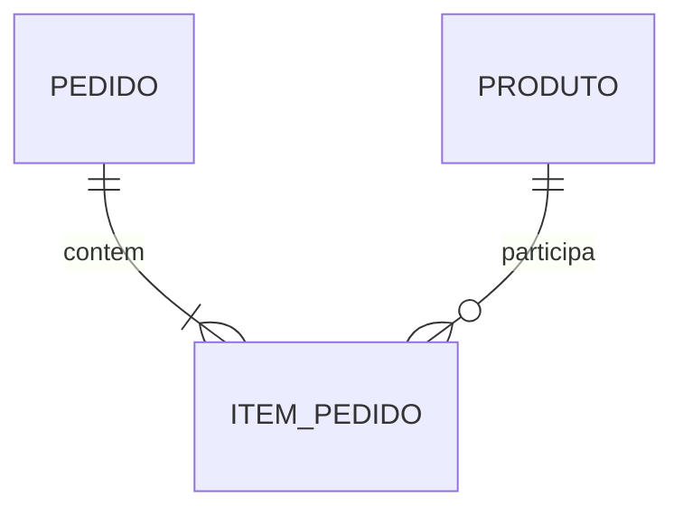

# Cantina Horizonte — planejamento inicial e revisão MbB
Data local: 6 de outubro de 2026.
Sistema-base do piloto aprovado pelo Professor Ronaldo nesta conversa.
Toda escrita externa desta etapa: mundobitbyte/site-reforma-mbb, branch preparacao/isolamento-inicial.

## Decisão e estado real
A aprovação encerra a pendência de escolha do sistema-base do piloto. A proposta já não está aguardando autorização para iniciar o planejamento.
A revisão circular/espiral desta etapa sustenta o início do núcleo pequeno, não certifica todo o produto nem todos os módulos. O percurso continua sujeito à varredura tópico a tópico.

Concluído: contexto, escopo, decisões iniciais, requisitos/aceitação, matriz de rastreabilidade, modelos conceitual/lógico e primeiro schema físico adicional validado.
Ainda não concluído: aplicação evolutiva, API/UI integradas a esse schema, cupom, transições, revisão curricular completa, testes visuais e publicação.

## Revisão MbB do que foi feito até agora
| Perspectiva | Crítica encontrada | Ajuste decidido |
|---|---|---|
| Especialista | Testes smoke verdes eram insuficientes para regras reais | Manter a distinção entre testes existentes e sondagens negativas; usar os requisitos como oráculo |
| Professor | Análise, BD e QTS poderiam continuar como blocos separados mesmo com o mesmo nome de projeto | Cada fatia deve carregar requisito, processo, entidade, implementação e evidência do mesmo fluxo |
| Iniciante | Receber app/API/SQL prontos esconderia a necessidade de cada conceito | Começar pelo problema e experimento; mostrar o limite; construir conceito e código em passos curtos |
| Micro | Quantidade válida por linha pode exceder estoque ao repetir produto | Consolidar por produto e validar a quantidade final antes de gravar |
| Micro | Atualizar preço do cadastro poderia reescrever valor histórico | Guardar preço unitário da venda em item_pedido |
| Micro | REAL e regras dispersas poderiam produzir interpretações diferentes de valor | Usar centavos inteiros na primeira implementação SQLite; formatar reais só na interface |
| Micro | Chaves estrangeiras declaradas não estavam aplicadas na v1 | Habilitar/verificar foreign_keys em toda conexão da evolução |
| Macro | “Demonstração”, “protótipo” e “aplicação executável” poderiam parecer a mesma evidência | Identificar o nível de cada artefato e os testes realmente executados |
| Macro | O garimpo inicial destacava comercio e a Central de terminal | Incorporar loja_integrador e Central Desktop como fontes distintas; seus modelos não são equivalentes |
| Espiral | Corrigir tudo antes da aula eliminaria o laboratório de defeitos | Preservar Cantina v1 e criar evolução identificada; ambas pertencem ao mesmo domínio |

A escolha da Cantina continua justificável neste escopo: há cadeia executável e requisitos, material de programação e estrutura de pedidos reaproveitável em BD. Se a varredura posterior revelar conflito pedagógico relevante, registrar e revisar a decisão; não forçar o conteúdo a caber.

## Contexto e problema
Contexto didático fictício: Cantina da Escola Horizonte.
Problema do piloto: registrar pedidos e movimentar estoque sem aceitar quantidades impossíveis ou perder o registro da venda.
Não é pesquisa realizada com usuários reais. Cliente e atendente são papéis propostos para análise; ainda não correspondem a identidades autenticadas.

Objetivo: o mesmo pedido deverá ser compreendido em Análise, modelado em BD, implementado em Python/API/Web, versionado e verificado em QTS.

Dentro do núcleo: produtos, pedido, itens, cálculo, estoque e consulta; cupom e preparação nas fatias seguintes.
Fora da primeira fatia: cadastro de aluno/cliente, dados pessoais, autenticação, pagamento, fornecedor, notificação, mobile, receitas e multiunidade.
Categorias/clientes não entram só porque loja_integrador os possui.

Produção oficial, SQL originais e Cantina v1 preservados. Academia, Santa Filomena e aplicativos práticos de App Inventor permanecem fora.

## Necessidade → conceito → evidência
| Situação e limite | Conceito necessário | Prática e entrega reutilizável |
|---|---|---|
| A pessoa pede 0 ou mais unidades do que a cantina tem | Validação, condição e limite | Regra de quantidade/estoque; teste ligado a RF-03/RF-04 |
| O mesmo produto aparece duas vezes no carrinho | Coleção, agrupamento e soma | Uma quantidade consolidada por produto, usada também pela API |
| Fechar o programa faz perder o pedido | Persistência e relacionamento | Pedido e itens no mesmo banco, consultáveis depois |
| Grava o pedido, mas falha ao baixar estoque | Transação e atomicidade | Pedido/itens/estoque confirmados juntos ou nenhum efeito |
| Preço de hoje muda, mas a venda de ontem deve continuar igual | Dados históricos | Preço unitário no item do pedido |
| Duas interfaces precisam concordar sobre estoque/total | API e responsabilidade do servidor | Ambas consultam e operam o mesmo sistema |
| Uma regra muda e quebra algo anterior | Regressão e rastreabilidade | Testes e histórico Git acompanhando o requisito |

VisuAlg pode apoiar o raciocínio proporcionalmente. A evolução em Python reutiliza a mesma regra; não cria um projeto paralelo. Pequenas transferências continuam permitidas para verificar generalização.

## Requisitos e critérios de aceitação
A numeração RF-01 a RF-09 e RQ-01/RQ-02 permanece ligada à fonte qts/cantina-horizonte-v1/docs/requisitos-base.md. As decisões abaixo refinam a evolução, sem alterar esse documento original.

| ID | Critério da evolução | Fatia |
|---|---|---|
| RF-01 | Listar id, nome, preço e estoque da mesma base utilizada pelo pedido | 1 |
| RF-02 | Produto existente pode compor pedido; repetição é consolidada por produto | 1 |
| RF-03 | Quantidade consolidada por produto é inteira de 1 a 10; rejeitar booleano, fração, zero e negativo na fronteira da API | 1 |
| RF-04 | Demanda consolidada não excede estoque; duas tentativas não podem vender o mesmo saldo duas vezes | 1, com teste de concorrência antes de declarar proteção |
| RF-05 | Desconto exige mínimo, validade e condição de uso; definir e documentar o ciclo de uso antes de implementar | 2 |
| RF-06 | Sem cupom na fatia 1: total = soma de quantidade × preço histórico, em centavos; nunca negativo | 1; desconto na 2 |
| RF-07 | Pedido só é confirmado com ao menos um item e todas as regras aplicáveis atendidas | 1 |
| RF-08 | Confirmar pedido baixa estoque; erro durante a gravação reverte pedido, itens e estoque | 1 |
| RF-09 | Só permitir Novo → Confirmado → Em preparação → Pronto → Entregue | 3 |
| RQ-01 | Entrada recusada apresenta mensagem compreensível e preserva os dados | 1 e revisão com usuário |
| RQ-02 | Fluxo principal utilizável a 360 px sem rolagem horizontal da página | Interface e teste visual |

Decisão de agrupamento: o pedido possui um item por produto; adicionar novamente aumenta essa quantidade. É uma definição explícita para eliminar a ambiguidade, não uma alegação de que a v1 já se comporta corretamente.
Enquanto cupom não estiver implementado, a interface da evolução não deverá anunciar desconto funcional. O sistema deverá explicar indisponibilidade, sem aceitar silenciosamente uma promessa que não cumpre.

## Modelos conceitual e lógico — fatia 1
Conceitual: Pedido representa a solicitação registrada; Produto representa algo vendável; Item do Pedido relaciona um produto a um pedido e registra quantidade/preço daquele momento.

Um pedido confirmado tem um ou mais itens. Um produto pode nunca ter sido vendido. Item pertence a exatamente um pedido e um produto. A aplicação pode construir um pedido temporariamente vazio dentro da transação; deve rejeitar sua confirmação vazia.

| Relação lógica | Atributos | Chaves e invariantes |
|---|---|---|
| produto | id, nome, preco_centavos, estoque | PK id; nome não vazio; preço/estoque inteiros não negativos |
| pedido | id, criado_em, status | PK id; status inicial Novo; nomes de estado conhecidos |
| item_pedido | pedido_id, produto_id, quantidade, preco_unitario_centavos | PK composta; duas FK; quantidade 1–10; preço histórico inteiro não negativo |
| resumo_pedido (visão) | id, criado_em, status, subtotal_centavos | Subtotal derivado dos itens; não usa preço atual do cadastro |

O modelo físico adicional está em laboratorio/cantina-evolutiva/schema-inicial.sql. Ele não modifica comercio, loja_integrador ou o schema da Cantina v1.
Cupom e eventual histórico de transições só serão acrescentados com suas regras e evidências. Não modelar cliente/categoria sem necessidade confirmada.

## Decisões técnicas proporcionais
- SQLite/Python/FastAPI para o núcleo inicial, conforme a proposta aprovada.
- Dinheiro armazenado em centavos inteiros nessa evolução. Exemplo: R$ 3,00 = 300; dois itens = 600.
- Subtotal derivado de preço histórico e quantidade. Valor monetário em reais é apresentação, não outra fonte de verdade.
- Um item por produto em cada pedido; agrupamento ocorre antes de validar/gravar.
- Operação de pedido numa transação; baixa de estoque condicional e resultado verificado.
- Toda conexão habilita foreign_keys antes de iniciar transação. A configuração não é propriedade permanente do arquivo SQLite.
- Schema limita valores individuais, mas não impõe sozinho pedido não vazio, soma do estoque, sequência de estados, concorrência ou política de cupom. Essas garantias precisam de serviço/API e testes.
- Banco de laboratório próprio; criação não executada contra nenhum arquivo da v1.
- Não trocar os comandos MySQL por SQLite no material original. Explicar diferenças reais de representação, chaves, funções e restrições na adaptação curricular.

## Rastreabilidade da primeira fatia
| Requisito | Processo/tela proposta | Dados/operação | Teste a implementar na API/serviço |
|---|---|---|---|
| RF-01 | Consultar cardápio | SELECT produto | CT-01 listar dados iniciais |
| RF-02/RF-03 | Montar carrinho | Agrupar produto/quantidade | CT-02 repetição; CT-03 limites e tipos |
| RF-04 | Confirmar pedido | Verificar/baixar saldo por produto | CT-04 insuficiência; CT-05 duas tentativas |
| RF-06 | Conferir subtotal | Preço histórico × quantidade | CT-06 valor exato; CT-07 mudança posterior do preço |
| RF-07 | Finalizar | Rejeitar pedido vazio | CT-08 vazio sem efeitos |
| RF-08 | Persistir | Transação pedido/itens/estoque | CT-09 sucesso; CT-10 falha intermediária; CT-11 reabrir |
| RQ-01 | Mostrar resposta | Erro de domínio traduzido para mensagem | CT-12 mensagem e banco preservado |
| RQ-02 | Usar em celular | Layout e controles | CT-13 navegador real a 360 px |

Esses CT são planejamento, não testes da aplicação já aprovados. A evidência do schema abaixo é separada para evitar confundir camada de dados com fluxo completo.

## Validação executada nesta etapa
Schema criado e exercitado em SQLite temporário: **15 cenários passaram**.
- Rejeitou preço fracionário, estoque negativo/fracionário e nome vazio.
- Rejeitou quantidade 0, -1, 11 e 1,5.
- Rejeitou item sem pedido/produto e produto repetido no mesmo pedido.
- Rejeitou nome de estado desconhecido.
- Alterar preço do cadastro não mudou o subtotal histórico: 600 centavos.
- Falha numa atualização de estoque dentro da transação reverteu pedido e item dessa tentativa, preservando o saldo anterior.
- Após fechar/reabrir, o subtotal anterior continuou disponível.

Isso comprova as restrições exercitadas e o experimento transacional local. Não comprova API, interface, concorrência, sequência de estados, disponibilidade ou proteção contra todas as falhas.
Hashes protegidos de pages/bancodedados.html e assets/seguranca-dados/mysql-general-log-lab.sql conferidos: nenhuma diferença. A Cantina v1 também foi verificada separadamente contra o snapshot local.

## Fatias e portas de passagem
1. Planejamento/modelos: entregue nesta etapa; revisar durante a implementação.
2. Pedido persistente: serviço/API/UI com critérios RF-01/02/03/04/06/07/08; só marcar concluído com testes de integração e concorrência apropriados.
3. Cupom: fechar política de mínimo, data, uso e arredondamento; implementar e testar junto ao pedido.
4. Estados: transições e evidências de atualização/consulta.
5. Percurso: classificar e adaptar tópico a tópico, preservando material de referência e encadeamento.
6. Entrega: revisão visual, acessibilidade, execução repetível, documentação e prévia quando houver hospedagem compatível.

Não iniciar expansão só porque existe conteúdo disponível. Perguntar a cada tópico: qual necessidade motiva o conceito, que artefato produz e quem o reutiliza?

## Pendências e bloqueios
Não há aprovação pendente para o planejamento e a evolução pequena já autorizados.
Hospedagem privada compatível segue sem solução confirmada; execução PHP continua bloqueada no ambiente. Nenhum desses pontos impede o núcleo Python local.
A política detalhada do cupom ainda exige fechamento antes de sua fatia. A v1 tem um marcador utilizado; não supor automaticamente uso por aluno/cliente, pois não há cadastro no núcleo.
Protótipo, interface e testes com usuários reais continuam sem validação completa. Não inventar resultados.

Próximo passo autorizado: implementar o serviço/API do pedido persistente a partir deste modelo e verificar as garantias planejadas, mantendo a revisão micro/macro a cada mudança.
